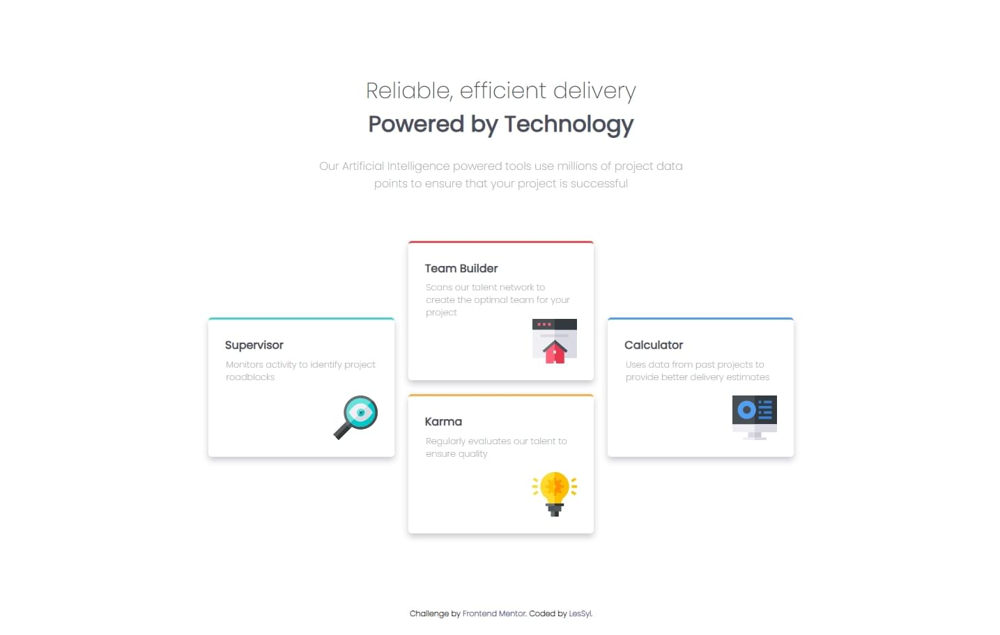
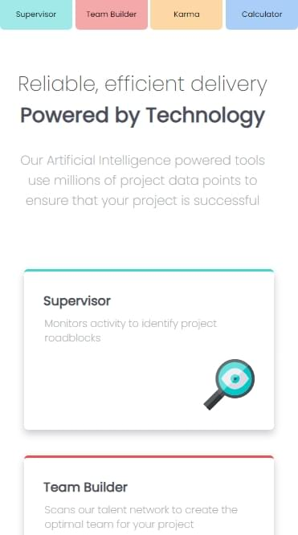
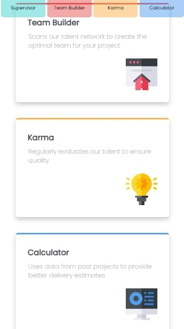
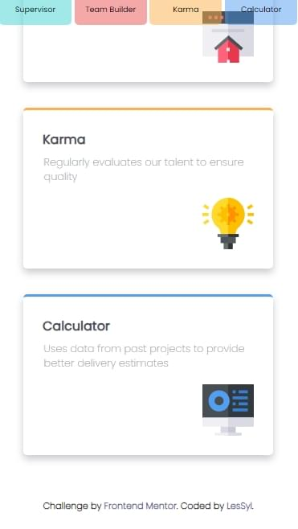

# Frontend Mentor - Four card feature section solution

This is a solution to the [Four card feature section challenge on Frontend Mentor](https://www.frontendmentor.io/challenges/four-card-feature-section-weK1eFYK). Frontend Mentor challenges help you improve your coding skills by building realistic projects. 

## Table of contents
- [Overview](#overview)
  - [Screenshot](#screenshot)
  - [Links](#links)
- [My process](#my-process)
  - [Built with](#built-with)
  - [What I learned](#what-i-learned)
- [Author](#author)

## Overview

### Screenshot

Desktop

Mobile

### Links

- Repository URL:[GitHub](https://github.com/LesSyl/Four-card-feature-section)
- Solution URL: [Frontendmentor](https://www.frontendmentor.io/solutions/four-card-feature-section-solution-Hk7s1UhXim)
- Live Site URL: [Live](https://lessyl.github.io/Frontend-Mentor---Four-card-feature-section/)
## My process

### Built with

- Semantic HTML5 markup
- Mobile-first workflow
- Sass
- BEM
- Flexbox
- Grid

### What I learned

In this project I used display:grid and hosted my own fonts for the first time using @font-face. Through this, I learned a lot of different things. Also, I used em instead of px in the media queries. 

## Author

- Frontend Mentor - [@LesSyl](https://www.frontendmentor.io/profile/LesSyl)
- gitHub - [@LesSyl](https://github.com/LesSyl)
